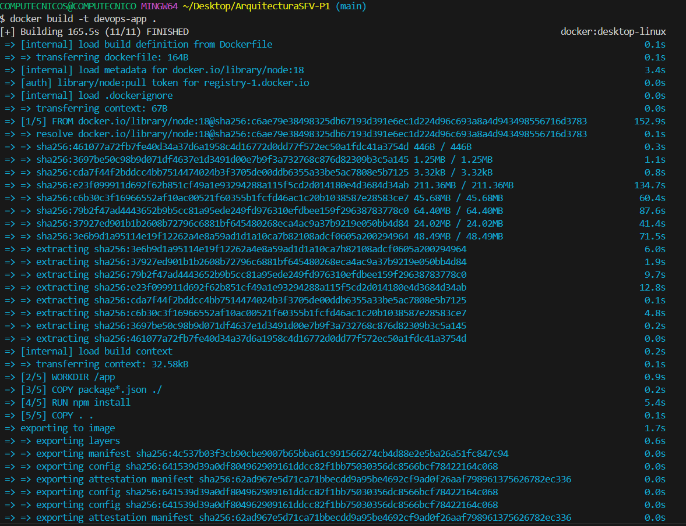
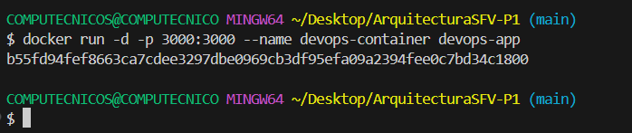
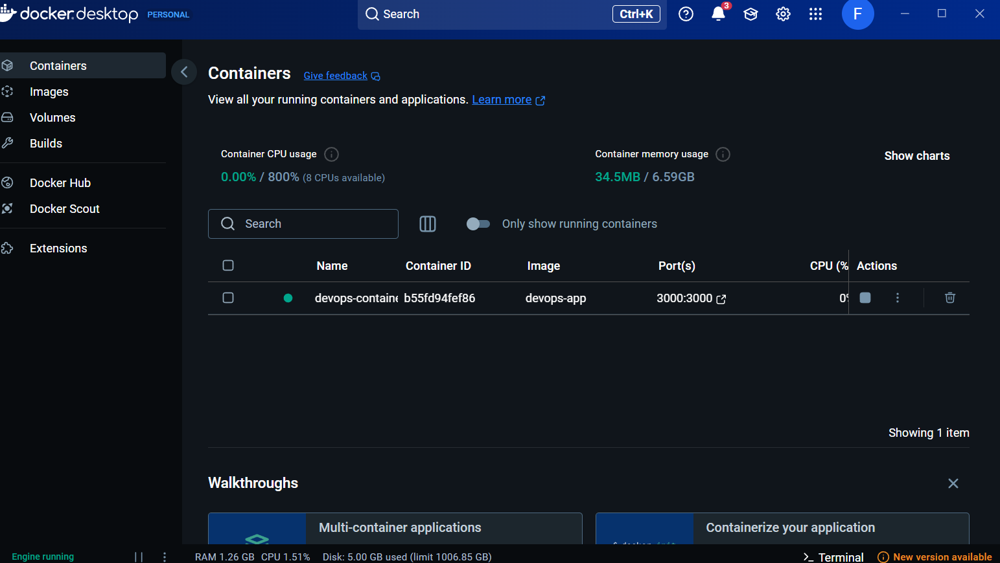
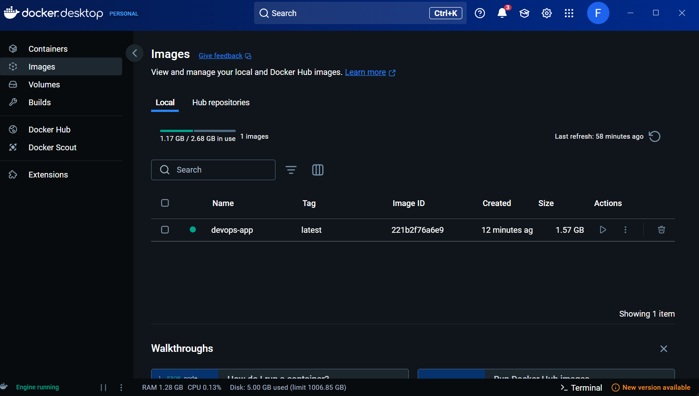

# ArquitecturaSFV-P1

# Evaluación Práctica - Ingeniería de Software V

## Información del Estudiante
- **Nombre:**
- **Código:**
- **Fecha:**

## Resumen de la Solución
La solución consiste en una aplicación web desarrollada con Node.js y Express, que fue contenerizada utilizando Docker. La app expone dos endpoints (/ y /health) y muestra información relevante del entorno de ejecución. Se construyó una imagen Docker eficiente y se ejecutó un contenedor que permite comprobar el correcto funcionamiento de la aplicación.

## Dockerfile
El Dockerfile fue diseñado con las siguientes decisiones clave:

Imagen base: Se utilizó la imagen oficial de Node.js (node:20) por ser estable y ampliamente soportada.

Directorio de trabajo: Se estableció /app como WORKDIR para mantener la organización del proyecto dentro del contenedor.

Copia y cacheo eficiente: Se copian primero los archivos package*.json para aprovechar la caché de Docker en la instalación de dependencias (npm install).

Exposición de puerto: Se expuso el puerto 3000, que es donde la aplicación escucha por defecto.

Comando final: Se utiliza CMD ["node", "index.js"] para iniciar la aplicación.


## Script de Automatización
[Describe cómo funciona tu script y las funcionalidades implementadas]

## Principios DevOps Aplicados

1. Automatización: Se automatizó el despliegue de la aplicación usando Docker, eliminando pasos manuales de instalación y configuración.

2. Portabilidad: Gracias al contenedor Docker, la aplicación puede ejecutarse en cualquier entorno sin necesidad de configurar dependencias locales.

3. Observabilidad y salud: El endpoint /health permite monitorear el estado de la aplicación, facilitando su integración con herramientas de monitoreo.


## Captura de Pantalla








## Mejoras Futuras
[Describe al menos 3 mejoras que podrían implementarse en el futuro]

## Instrucciones para Ejecutar
# DevOps Evaluation App

Esta es una aplicación básica en Node.js que expone dos endpoints (`/` y `/health`) para demostrar

## Requisitos Previos

- Docker instalado
- Node.js y npm (solo si quieres correrla sin Docker)

## instrucciones

## Cómo Construir y Ejecutar la Aplicación en Docker

### 1. Clona el repositorio (si aplica)

```bash
git clone <repositorio>
cd <directorio>

```
## Construir la imagen Docker

docker build -t devops-app .

## Ejecutar el contenedor

docker run -d -p 3000:3000 --name devops-container devops-app

## Verificar que funciona

Visita http://localhost:3000 para ver el mensaje de bienvenida.

Visita http://localhost:3000/health para el endpoint de salud.
